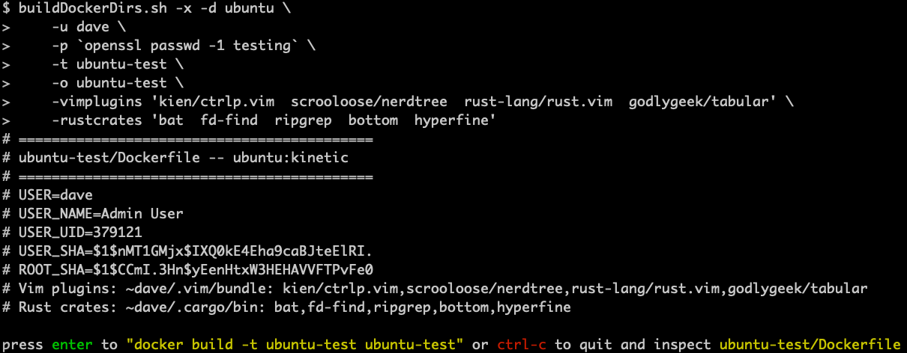
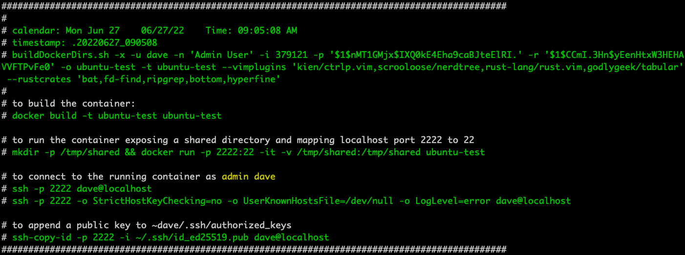
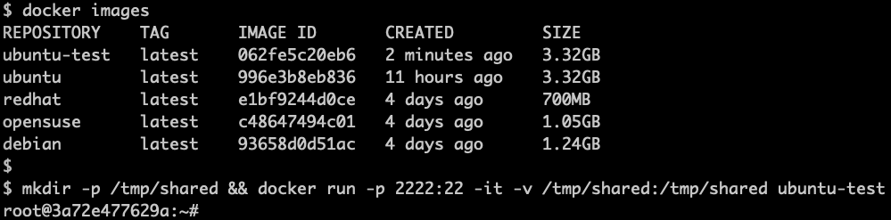
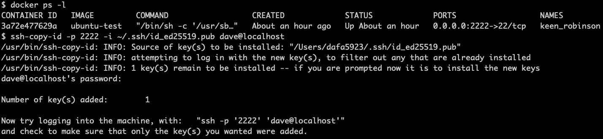
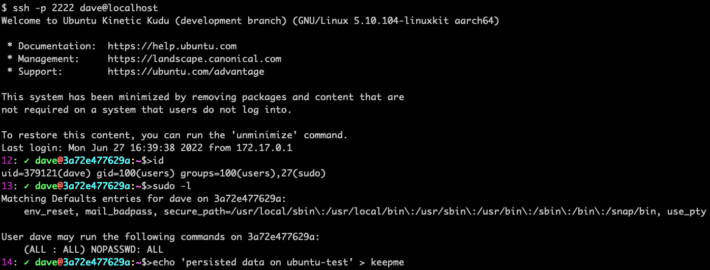
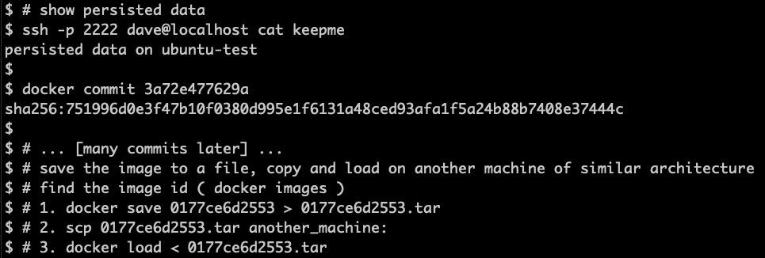

# Docker-Linux &emsp; ![Latest Version]

[Latest Version]: https://img.shields.io/badge/Docker_Linux-v0.1.0-blue

### Generates Dockerfiles for Linux distributions **Debian**, **openSUSE**, **RedHat**, **Ubuntu**
#### Common tooling with a configured admin account

Features:

* Distributions are configured with a sudo account populated from files placed in **user_common**
* The containers accept **ssh connections**
* Common tools installed for each distribution (**curl**, **gcc**, **git**, **jq**, **less**, **man**, **openssh**, **perl**, **python3**, **sudo**, **vim**)
* **Vim plugins** can be downloaded from github
* **Rust crates** can be installed
* *If Rust is installed so are a few of my Rust tools from github ( **b64**, **num**, **sha**, **utf8char**, **uuid** )*

---

To create the Docker build directories run **buildDockerDirs.sh**:

~~~sh
# create the build directory for each distribution with defaults
buildDockerDirs.sh -d debian
buildDockerDirs.sh -d opensuse
buildDockerDirs.sh -d redhat
buildDockerDirs.sh -d ubuntu
~~~

---

The **user_common** files are copied to the container's user account

~~~sh
user_home/
├── .bash_logout
├── .bash_profile
├── .bashrc
├── .editrc
├── .inputrc
├── .ssh
│   └── authorized_keys
├── .vars
├── .vim
│   └── colors
│       └── dave.vim
├── .vimrc
└── bin
    ├── chop
    ├── corr.pl
    ├── cutcol.pl
    ├── detab
    ├── endian
    ├── exp
    ├── fp
    ├── hexbytes
    ├── imgcat
    ├── ip2hex
    ├── lst
    ├── md5
    ├── ncol.pl
    ├── prec
    ├── rename.pl
    ├── rpm.help
    ├── rsy
    ├── rsyd
    ├── sed.help
    ├── sort.pl
    ├── trim
    ├── unexp -> exp
    └── vars
~~~

---

**buildDockerDirs.sh** has a few configurable options

~~~sh
Usage: buildDockerDirs.sh [OPTIONS] -d distribution
    -d  distribution
          debian        # debian:bullseye
          opensuse      # opensuse/leap
          redhat        # redhat/ubi9
          ubuntu        # ubuntu:kinetic
Options:
    -u  user                # (default derived from the shell)
    -n  name                # (default is "Admin User")
    -i  uid                 # (default derived from the shell)
    -p,-r "password sha"    # (default is "admin", "root" respectively)
        password sha can be generated offline: openssl passwd -[156] cleartext
    -o  output              # Docker directory (defaults to distribution name, will not overwrite)
    -t  tag                 # Docker image tagname
    -vimplugins "bundles"   # download vim pathogen and plugins from github e.g. -vimplugins "kien/ctrlp.vim,scrooloose/nerdtree,..."
    -rustcrates "crates"    # download the Rust compiler and build crates e.g. -rust "bat,ripgrep,..."

    -x  execute             # opportunity to execute the docker build on the completed directory
~~~

---

The **-x** option will prompt to issue the **docker build** command

... [docker build completes] ...

---

# **Persisting** changes to a running container

----
~~~
start the container instance
----------------------------
~~~

---

~~~
add ssh public key
------------------
~~~

---

~~~
login - display sudo privs -- write a file
------------------------------------------
~~~

---

---

~~~
verify change in the running container - commit changes
-------------------------------------------------------
~~~

